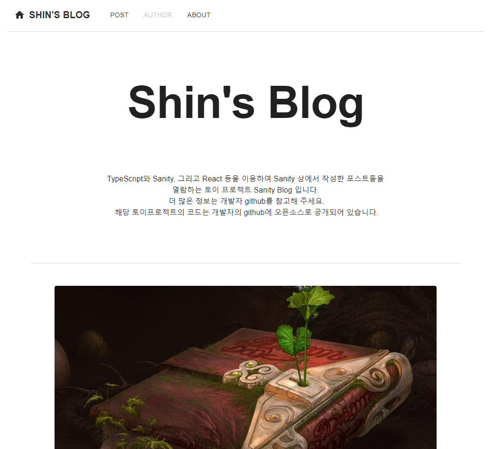
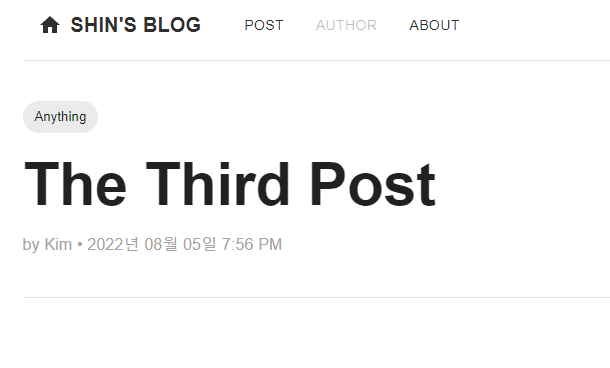

# <div style="font-size:40px" align = "center"> Sanity Blog </div>

[Sanity](https://www.sanity.io/)에서 제공하는 DB와 인터페이스를 기반으로 작성된 게시글을 조회하는 Next.js 기반 `SSR(Server-Side-Rendering)`사이트입니다. Sanity DB는 보안상의 이유로 Repository 내에는 제공되지 않으며 Front-End 단의 코드만 공개처리되어 있습니다.

## 🍳 TodoList

---

- 현재 작성된 게시글을 조회하는 기능만 구현되어 있습니다.

- 게시글 수정 및 작성기능 구현예정, 단 Sanity 무료 기능의 한계로 별도의 권한계정 생성기능은 구현불가 상태

&nbsp;

# <div align="center">📚 Stacks</div>

<div align="center">


</div>

&nbsp;

# <div align="center">⚽ Installation</div>

Note: `package.json` 에 관련 dependency가 등록되어 있습니다.

[Netlify](https://www.netlify.com/) 로 온라인 배포되어 있습니다.<br><br>
별도의 코드 review 없이 결과물을 조회하고 싶다면 이쪽을 권장합니다. <br>

🔑 배포 링크 : https://incredible-kangaroo-b4b5e0.netlify.app/

&nbsp;

## ⚡Development 모드로 실행

---

&nbsp;
현 Repository 를 `git clone` 합니다.

```
git clone https://github.com/FriedBob/sanity-nextjs-blog.git
```

&nbsp;

터미널 상에서 다음 명령어를 입력하여 연관 패키지를 설치합니다.

```
npm install
```

&nbsp;

이후 프로젝트를 실행하기 위해서 다음 코드를 터미널 상에서 입력합니다.

```
npm run dev
```

프로젝트는 https://localhost:3000 상에서 실행됩니다. <br><br>

&nbsp;
`git clone`한 프로젝트의 `next.config.js` 파일에 연동하기위한 Sanity의 백엔드 `project id`가 기술되어있습니다.

&nbsp;

## ⚡Production 모드로 실행

---

온라인 배포된 프로젝트는 기본적으로 `Production` 모드로 동작합니다.<br>
이 항목은 Local 상에서 `Production` 모드로 프로젝트를 실행하는 법을 안내합니다.<br><br>

터미널 상에서 다음 코드를 입력하여 프로젝트를 빌드합니다.

```
npm run build
npm run export
```

&nbsp;

이후 다음 코드를 입력하여 프로젝트를 `Production` 모드로 실행할 수 있습니다.

```
npm start
```

&nbsp;

포트는 `Development` 모드와 동일한 https://localhost:3000 입니다.

&nbsp;

Next.js의 `getStaticProps`와 `getStaticPath`를 활용한 `SSG(Static-Site-Generation)` 방식을 사용하여 정적 페이지를 빌드 타임에 미리 생성, 요청 시 반환하여 페이지 라우팅 / 로딩이 `Development` 모드에 비해 빠릅니다.

&nbsp;&nbsp;

# <div align="center">🏫 Features</div>

&nbsp;

## ✔ 랜딩 페이지

---

- 페이지 접속 시 보는 첫 화면입니다. <br>

<div align="center">

</div>

<br>

- 헤더의 서브메뉴를 클릭하여 다음 정보를 볼 수 있는 페이지로 연결됩니다.
  - 게시글 목록 조회
  - 게시글 작성자 목록 조회 (미구현)
  - 제작자 깃허브 정보

&nbsp;

- 하단에는 대표 게시글과 최신 게시글 목록을 볼 수 있으며 클릭시 해당 포스트로 연결됩니다.

<div align="center">

</div>

&nbsp;

## ✔ 포스트

---

- Sanity에서 작성한 포스트를 조회할 수 있습니다.

- Sanity에서 기본적으로 지원하는 기능 외 몇가지 양식이 더 지원됩니다.
  - `ImageGallery` : 이미지 리스트
  - `Video` : 유튜브 등의 영상링크를 가져와 사이트에서 직접 재생
  - `OpenGraph` : 기본 Url 외에 오픈그래프 형식으로 작성가능
  - `CodeBlock` : 코드블록

<div align="center">
 
</div>
<br>

- 표시정보 : 제목, 작성일, 태그, 작성자

&nbsp;

## ✔ 포스트 리스트

---

- 블로그에 작성된 포스트 목록을 조회할 수 있는 페이지입니다.

- 포스트 작성자, 날짜, 태그, 부제, 고유ID 를 한번에 볼 수 있습니다.

- `React` 의 `RecoilState` 기능을 사용하여 정상적인 루트로 페이지 접속 시 포스트 정보가 저장됩니다.

  &nbsp;

<div align ="center">
  
</div>

&nbsp;

- 클릭 시 해당 포스트 페이지로 이동하며 상단의 헤더에서 언제든지 `POST 버튼` 을 클릭하여 포스트 리스트로 돌아올 수 있습니다.

&nbsp;

## ✔ About 페이지

---

&nbsp;

<div align="center">

</div>

&nbsp;

- 제작자의 `github` 정보 페이지입니다.

- 클릭시 해당 사이트로 이동합니다.

&nbsp;
